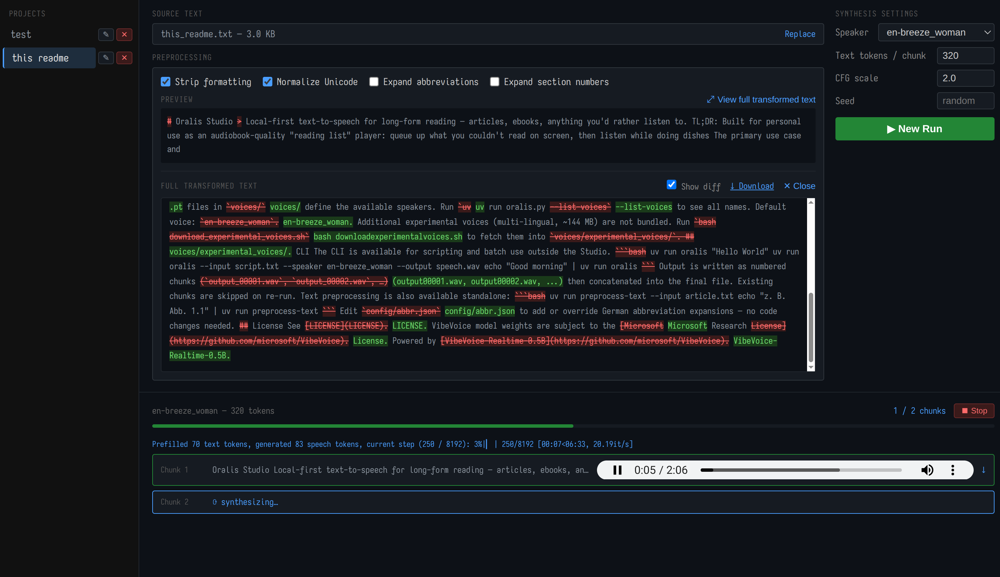

# Oralis Studio

> Local-first text-to-speech for long-form reading — articles, ebooks, anything you'd rather listen to.

TL;DR: Built for personal use as an audiobook-quality "reading list" player: queue up what you couldn't read on screen, then listen while doing dishes

The primary use case and motivation to create this was the lack of local first text-to-speech tooling capable of synthesizing larger text volumes into audiobook-like quality audio files. I am using this as a "reading list" for articles on the internet and sometimes ebooks. When I do laundry, dishes, cooking and otherwise mundane task, I do listen to a curated set of articles I was not able to read on the screen. This is why it exists, and all features I will consider adding here will be always put into that perspective.

> [!WARNING]
> This is a personal tool, not a production service. It is mostly vibe-coded and it takes shortcuts (direct filesystem project management, no auth). Do not expose it to the public internet. Use for your pesonal amusement only.



<video src='https://github.com/pulsar256/oralis/raw/refs/heads/main/docs/example.mp4'/>

## Installation

```bash
uv sync
```

Requires Python ≥ 3.10. A ROCm-enabled GPU is strongly recommended; CPU inference works but is slow.

## Studio

The web UI is the main interface. It manages projects, preprocesses text, and tracks synthesis progress.

```bash
uv run studio
```

Opens at `http://localhost:8000`.

```bash
HOST=0.0.0.0 PORT=9000 uv run studio   # custom host/port
```

**What you can do in the Studio:**

- **Projects** — create named projects, each holding source text and synthesis runs
- **Preprocessing** — normalize Unicode, expand German abbreviations, convert section numbers to spoken form — with a live diff so you see exactly what changed before committing
- **Synthesis** — pick a voice, run TTS, watch per-chunk progress in real time
- **Resume** — interrupted runs pick up from the last completed chunk automatically

## Voice Presets

`.pt` files in `voices/` define the available speakers. Run `uv run oralis.py --list-voices` to see all names.

Default voice: `en-breeze_woman`.

Additional experimental voices (multi-lingual, ~144 MB) are not bundled. Run `bash download_experimental_voices.sh` to fetch them into `voices/experimental_voices/`.

## CLI

The CLI is available for scripting and batch use outside the Studio.

```bash
uv run oralis "Hello World"
uv run oralis --input script.txt --speaker en-breeze_woman --output speech.wav
echo "Good morning" | uv run oralis
```

Output is written as numbered chunks (`output_00001.wav`, `output_00002.wav`, …) then concatenated into the final file. Existing chunks are skipped on re-run.

| Flag | Default | Effect |
|------|---------|--------|
| `--max-tokens N` | `512` | Maximum text tokens per synthesis chunk. Smaller values use less VRAM and produce shorter audio segments; larger values may improve prosody across longer sentences. |
| `--cfg-scale F` | `1.5` | Classifier-free guidance strength. Higher values make the output follow the text more strictly but can reduce naturalness; lower values sound more relaxed. |
| `--seed N` | *(unset)* | Fixed seed for reproducible output. Omit for non-deterministic synthesis. |

Text preprocessing is also available standalone:

```bash
uv run preprocess-text --input article.txt
echo "z. B. Abb. 1.1" | uv run preprocess-text
```

Edit `config/abbr.json` to add or override German abbreviation expansions — no code changes needed.

## License

See [LICENSE](LICENSE). VibeVoice model weights are subject to the [Microsoft Research License](https://github.com/microsoft/VibeVoice).

Powered by [VibeVoice-Realtime-0.5B](https://github.com/microsoft/VibeVoice).
