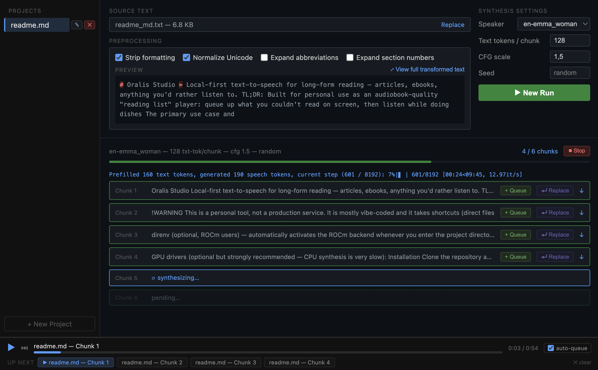

# Oralis Studio

> Local-first text-to-speech for long-form reading — articles, ebooks, anything you'd rather listen to.

TL;DR: Built for personal use as an audiobook-quality "reading list" player: queue up what you couldn't read on screen, then listen while doing dishes

The primary use case and motivation to create this was the lack of local first text-to-speech tooling capable of synthesizing larger text volumes into audiobook-like quality audio files. I am using this as a "reading list" for articles on the internet and sometimes ebooks. When I do laundry, dishes, cooking and otherwise mundane tasks, I do listen to a curated set of articles I was not able to read on the screen. This is why it exists, and all features I will consider adding here will be always put into that perspective.

> [!WARNING]
> This is a personal tool, not a production service. It is mostly vibe-coded and it takes shortcuts (direct filesystem project management, no auth). Do not expose it to the public internet. Use for your pesonal amusement only.



## Getting Started

### Prerequisites

**Python 3.10 or newer** — check with `python --version`. If you need to install it, use your system package manager or [python.org](https://www.python.org/downloads/).

**uv** — the package manager used by this project. Install it once:

```bash
# Linux / macOS
curl -LsSf https://astral.sh/uv/install.sh | sh

# Windows (PowerShell)
powershell -ExecutionPolicy ByPass -c "irm https://astral.sh/uv/install.ps1 | iex"
```

Restart your terminal after installing so `uv` is on your PATH.

**direnv** (optional, ROCm users) — automatically activates the ROCm backend whenever you enter the project directory. Install it once:

```bash
# Arch / Manjaro
sudo pacman -S direnv

# Ubuntu / Debian
sudo apt install direnv

# macOS
brew install direnv
```

Then hook it into your shell (add to `~/.bashrc`, `~/.zshrc`, etc.) and allow the project:

```bash
# bash
echo 'eval "$(direnv hook bash)"' >> ~/.bashrc

# zsh
echo 'eval "$(direnv hook zsh)"' >> ~/.zshrc
```

```bash
direnv allow   # run once inside the cloned repo
```

The included `.envrc` sets `UV_BACKEND=rocm` automatically on machines where `rocm-smi` is present, so `bash studio.sh` will use ROCm without any extra flags.

**GPU drivers** (optional but strongly recommended — CPU synthesis is very slow):

| Hardware | What to install |
|---|---|
| NVIDIA GPU (CUDA) | [CUDA Toolkit 12.x](https://developer.nvidia.com/cuda-downloads) |
| AMD GPU (ROCm) | [ROCm 6.4](https://rocm.docs.amd.com/en/latest/deploy/linux/index.html) |
| Apple Silicon | Nothing extra — MPS is built into macOS |

### Installation

Clone the repository and enter the directory:

```bash
git clone https://github.com/pulsar256/oralis
cd oralis
```

Install dependencies — pick the extra that matches your hardware:

```bash
uv sync --extra cuda   # NVIDIA GPU
uv sync --extra rocm   # AMD GPU (ROCm 6.4, Linux only)
uv sync --extra mps    # Apple Silicon
uv sync --extra cpu    # CPU only (slow)
```

## Studio

The web UI is the main interface. It manages projects, preprocesses text, and tracks synthesis progress.

```bash
bash studio.sh
```

Opens at `http://localhost:8000`. The script uses `UV_BACKEND` (default: `cuda`) to select the torch backend:

```bash
UV_BACKEND=rocm bash studio.sh
HOST=0.0.0.0 PORT=9000 bash studio.sh
```

**What you can do in the Studio:**

- **Projects** — create named projects, each holding source text and synthesis runs
- **Preprocessing** — normalize Unicode, expand German abbreviations, convert section numbers to spoken form — with a live diff so you see exactly what changed before committing
- **Synthesis** — pick a voice, run TTS, watch per-chunk progress in real time
- **Resume** — interrupted runs pick up from the last completed chunk automatically

## Voice Presets

`.pt` files in `voices/` define the available speakers. Run `uv run --extra cuda oralis --list-voices` to see all names.

Default voice: `en-breeze_woman`.

### Supported Languages

| Code | Language   | Bundled voices | Experimental voices |
|------|------------|:--------------:|:-------------------:|
| `en` | English    |       ✓        |          ✓          |
| `de` | German     |       ✓        |          ✓          |
| `fr` | French     |       ✓        |          ✓          |
| `it` | Italian    |       ✓        |          —          |
| `nl` | Dutch      |       ✓        |          —          |
| `pl` | Polish     |       ✓        |          ✓          |
| `pt` | Portuguese |       ✓        |          ✓          |
| `sp` | Spanish    |       ✓        |          ✓          |
| `jp` | Japanese   |       ✓        |          ✓          |
| `kr` | Korean     |       ✓        |          ✓          |
| `in` | Hindi      |       ✓        |          —          |

Experimental voices (~144 MB total) are not bundled. Fetch them with:

```bash
bash download_experimental_voices.sh
```

## CLI

Both components are available as console scripts for automation and batch use.

### Synthesis (`oralis`)

```bash
uv run --extra rocm oralis "Hello World"
uv run --extra rocm oralis --input script.txt --speaker en-breeze_woman --output speech.wav
echo "Good morning" | uv run --extra rocm oralis
```

| Flag | Default | Effect |
|------|---------|--------|
| `text` | *(none)* | Positional argument: the text to synthesize. |
| `-i`, `--input FILE` | *(none)* | Path to a `.txt` file to read. |
| `-o`, `--output PATH`| `output.wav` | Final output WAV path. |
| `--speaker NAME` | `en-breeze_woman` | Voice preset name. Use `--list-voices` to see all. |
| `--model MODEL` | `microsoft/VibeVoice-Realtime-0.5B` | HuggingFace model path or local directory. |
| `--device DEVICE` | `auto` | Force device: `cuda`, `rocm`, `mps`, or `cpu`. |
| `--cfg-scale F` | `1.5` | Classifier-free guidance strength. Higher follows text strictly; lower sounds more natural but riskier. |
| `--max-tokens N` | `512` | Maximum text tokens per synthesis chunk. |
| `--seed N` | *(unset)* | Fixed seed for reproducible output. |
| `--list-voices` | *(none)* | Print available voice preset names and exit. |
| `--progress-file PATH`| *(none)* | Write JSON progress (`chunk_count`, `current_chunk`) to this file. |

**Output Handling:** Audio is written as numbered chunks (`output_00001.wav`, `output_00002.wav`, …) then concatenated into the final file. Existing chunks are skipped on re-run, allowing automatic resume.

### Preprocessing (`preprocess-text`)

```bash
uv run --extra rocm preprocess-text "z. B. Abb. 1.1"
uv run --extra rocm preprocess-text --input article.txt --strip-formatting
```

| Flag | Default | Effect |
|------|---------|--------|
| `text` | *(none)* | Positional argument: the text to normalize. |
| `-i`, `--input FILE` | *(none)* | Path to a `.txt` file to read. |
| `-o`, `--output FILE`| *(stdout)* | Write result to a file instead of printing to terminal. |
| `--expand-abbreviations` | `false` | Expand German abbreviations (e.g., `Abb.` → `Abbildung`) using `config/abbr.json`. |
| `--expand-section-numbers` | `false` | Expand dotted section numbers (e.g., `1.1` → `eins punkt eins`). |
| `--strip-formatting` | `false` | Strip Markdown, code blocks, HTML tags, and URLs before normalizing. |

## License

See [LICENSE](LICENSE). VibeVoice model weights are subject to the [Microsoft Research License](https://github.com/microsoft/VibeVoice).

Powered by [VibeVoice-Realtime-0.5B](https://github.com/microsoft/VibeVoice).
